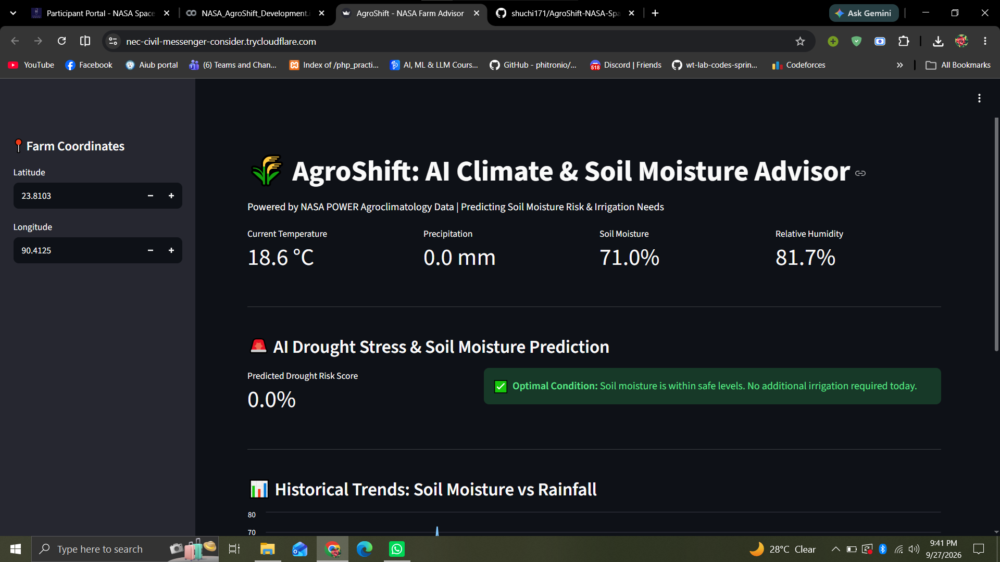
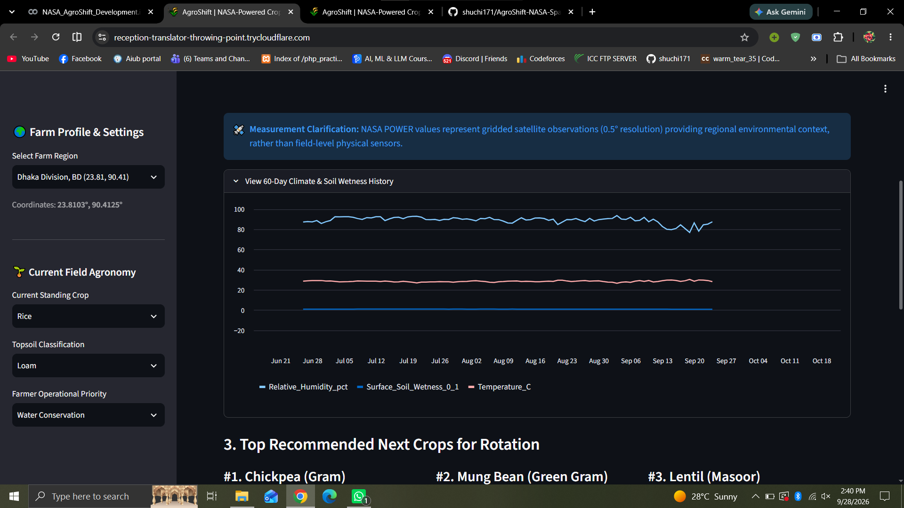

# AgroShift: AI Climate & Soil Moisture Advisor

> **NASA International Space Apps Challenge**  
> **Challenge:** Field Shift: Adapting Farms with NASA Data  

---

## 📌 Project Overview
**AgroShift** is an AI-powered agricultural advisory platform designed to help local farmers adapt to climate volatility, unexpected dry spells, and soil degradation. By combining real-time NASA satellite observations with predictive machine learning, AgroShift delivers timely soil moisture risk assessments and actionable irrigation guidance.

---

## 🛰️ NASA Data & Satellite Parameters
The system fetches daily agroclimatology data dynamically using the **NASA POWER API**:
- **T2M**: Surface Air Temperature at 2 Meters (°C)
- **PRECTOTCORR**: Corrected Total Precipitation (mm/day)
- **GWETTOP**: Surface Soil Wetness (0–1 profile)
- **RH2M**: Relative Humidity at 2 Meters (%)

---

## 🧠 Machine Learning & Architecture
- **Model:** Random Forest Classifier trained on historical weather and soil wetness profiles.
- **Task:** Predicts the risk of soil moisture dropping to critical drought-stress thresholds for the upcoming day.
- **Advisory Engine:** 
  - **High Risk (≥ 50%):** Triggers an urgent irrigation alert to safeguard crops.
  - **Optimal Risk (< 50%):** Informs farmers that soil moisture levels are safe, preventing over-irrigation.
- **Dashboard:** Interactive web application built with Streamlit and deployed via Cloudflare Tunnel.

---
## 📸 Dashboard Preview






## 🛠️ Tech Stack
- **Language:** Python
- **Libraries:** Streamlit, Pandas, NumPy, Scikit-learn, Requests
- **Data Source:** NASA POWER Agroclimatology API
- **Tunneling / Hosting:** Cloudflare

---

## 🚀 How to Run Locally

1. **Clone the repository:**
   ```bash
   git clone [https://github.com/shuchi171/AgroShift-NASA-SpaceApps.git](https://github.com/shuchi171/AgroShift-NASA-SpaceApps.git)
   cd AgroShift-NASA-SpaceApps
